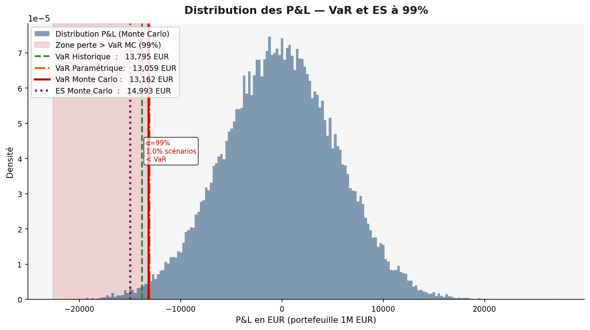
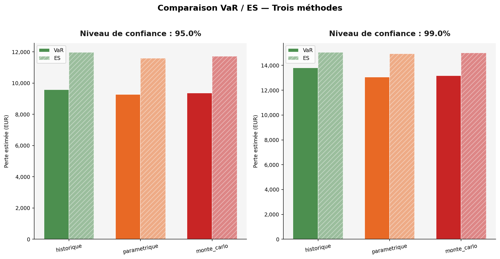
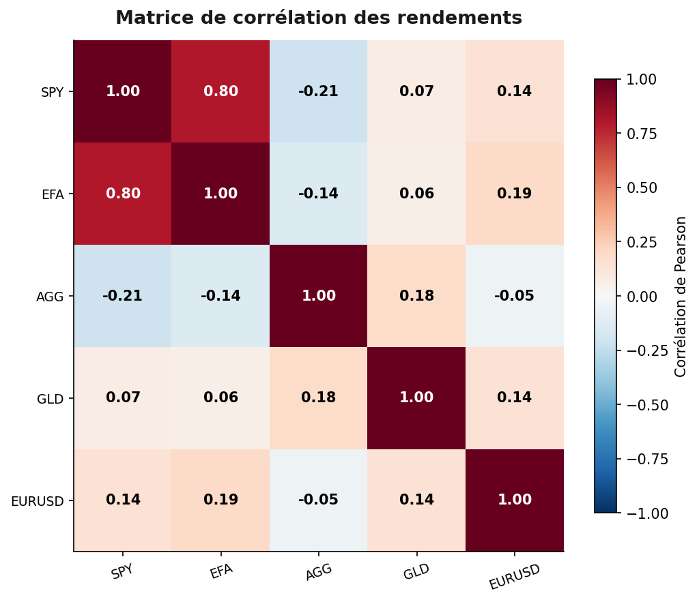
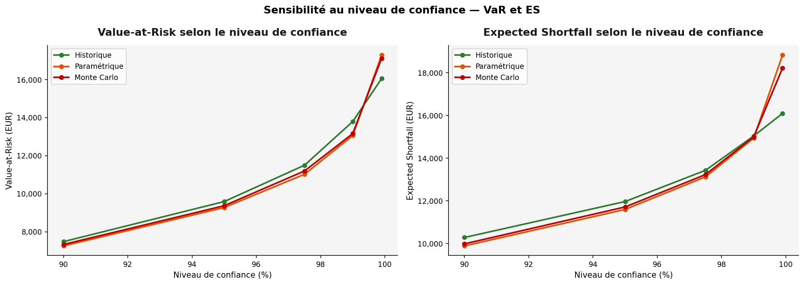
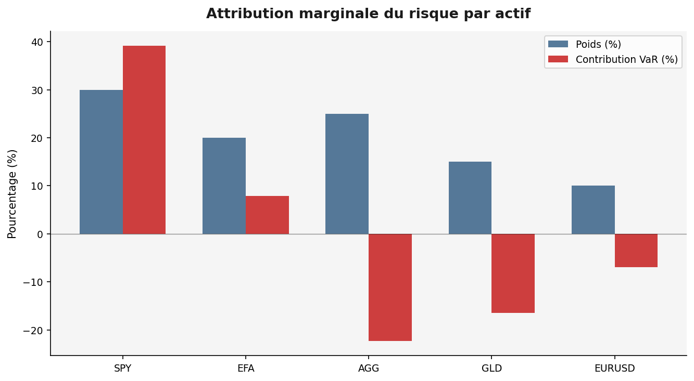

# Moteur Monte Carlo de VaR et Expected Shortfall pour portefeuille multi-actifs

Projet Python de finance quantitative consacré à l'estimation de la Value-at-Risk (VaR) et de l'Expected Shortfall (ES) d'un portefeuille multi-actifs, avec comparaison de méthodes historiques, paramétriques et Monte Carlo.

L'objectif du dépôt est de proposer un projet académique propre, reproductible et défendable, adapté à un profil de Master 1 souhaitant valoriser un intérêt pour :

- la gestion des risques de marché ;
- la simulation Monte Carlo ;
- les mesures de risque de portefeuille ;
- l'analyse de sensibilité ;
- la finance quantitative appliquée ;
- la production d'un pipeline Python structuré.

## Sommaire

1. [Vue d'ensemble](#vue-densemble)
2. [Ce que fait le projet](#ce-que-fait-le-projet)
3. [Cadre quantitatif](#cadre-quantitatif)
4. [Méthodes retenues](#méthodes-retenues)
5. [Résultats clés](#résultats-clés)
6. [Aperçu visuel](#aperçu-visuel)
7. [Architecture du dépôt](#architecture-du-dépôt)
8. [Installation et exécution](#installation-et-exécution)
9. [Sorties générées](#sorties-générées)
10. [Compétences mises en évidence](#compétences-mises-en-évidence)
11. [Limites du projet](#limites-du-projet)
12. [Extensions naturelles](#extensions-naturelles)

## Vue d'ensemble

Le projet construit un moteur complet de calcul de risque pour un portefeuille composé de plusieurs classes d'actifs. La logique est la suivante :

1. charger des séries de prix multi-actifs ;
2. calculer les rendements logarithmiques ;
3. construire un portefeuille pondéré ;
4. calibrer les moyennes, volatilités, covariance et corrélations ;
5. calculer la VaR et l'ES par plusieurs approches ;
6. simuler une distribution de pertes et profits par Monte Carlo ;
7. analyser la sensibilité aux hypothèses de volatilité, corrélation, horizon et niveau de confiance ;
8. produire automatiquement des tableaux, des figures et un rapport.

Le projet n'a pas été pensé comme un modèle bancaire de production. Il vise plutôt une implémentation claire, pédagogique et sérieuse des fondamentaux du risk management quantitatif.

## Ce que fait le projet

Le pipeline complet permet de :

- charger et contrôler des données de prix multi-actifs ;
- construire un portefeuille depuis `config.yaml` ;
- estimer les paramètres statistiques des rendements ;
- calculer la VaR et l'Expected Shortfall historiques ;
- calculer la VaR et l'Expected Shortfall paramétriques sous hypothèse gaussienne ;
- simuler une distribution de P&L par Monte Carlo ;
- comparer les trois méthodes de mesure du risque ;
- tester une distribution normale ou Student-t pour la simulation ;
- effectuer des analyses de sensibilité ;
- mesurer l'attribution marginale du risque par actif ;
- réaliser un backtesting simplifié de Kupiec ;
- générer des tableaux CSV, des figures PNG et un rapport Markdown ;
- valider les propriétés principales par tests unitaires.

## Cadre quantitatif

Le projet mesure le risque de perte d'un portefeuille sur un horizon court. La convention retenue est :

```text
P&L positif  = gain
P&L négatif  = perte
VaR positive = montant de perte
```

### Rendements logarithmiques

Les rendements utilisés sont les log-rendements :

$$
r_t = \ln\left(\frac{P_t}{P_{t-1}}\right)
$$

Ce choix est standard pour un projet de modélisation financière car les log-rendements sont additifs dans le temps et se prêtent bien aux approximations gaussiennes de court terme.

### Rendement de portefeuille

Pour un vecteur de poids \(w\) et un vecteur de rendements \(r_t\), le rendement agrégé du portefeuille est :

$$
r_{p,t} = w^\top r_t
$$

Le P&L absolu est ensuite obtenu par :

$$
\operatorname{PnL}_t = V_0 \times r_{p,t}
$$

où \(V_0\) est la valeur initiale du portefeuille.

### Value-at-Risk

La VaR au niveau de confiance \(\alpha\) correspond au quantile de perte dépassé avec probabilité \(1-\alpha\).

Dans le code, la VaR est calculée à partir de la distribution des P&L :

$$
\operatorname{VaR}_{\alpha} = -Q_{1-\alpha}(\operatorname{PnL})
$$

Par exemple, une VaR 99% de 13 162 EUR signifie que, selon le modèle, la perte journalière ne devrait dépasser ce montant que dans environ 1% des cas.

### Expected Shortfall

L'Expected Shortfall mesure la perte moyenne conditionnelle au dépassement de la VaR :

$$
\operatorname{ES}_{\alpha} =
-\mathbb{E}\left[\operatorname{PnL} \mid \operatorname{PnL} \leq Q_{1-\alpha}(\operatorname{PnL})\right]
$$

Cette mesure complète la VaR car elle renseigne sur la sévérité des pertes extrêmes, pas seulement sur leur seuil.

## Méthodes retenues

### Méthode historique

La méthode historique utilise directement la distribution empirique des P&L passés. Elle ne suppose pas de forme paramétrique particulière, mais dépend fortement de la fenêtre de données disponible.

### Méthode paramétrique gaussienne

La méthode paramétrique suppose que le rendement du portefeuille suit une loi normale. Elle fournit une formule analytique simple :

$$
\operatorname{VaR}_{\alpha}
= -V_0 \left(\mu_h + \sigma_h z_{1-\alpha}\right)
$$

où :

- \(\mu_h\) est le rendement moyen à l'horizon \(h\) ;
- \(\sigma_h\) est la volatilité à l'horizon \(h\) ;
- \(z_{1-\alpha}\) est le quantile de la loi normale standard.

### Méthode Monte Carlo

La méthode Monte Carlo simule un grand nombre de scénarios de rendements corrélés à partir des paramètres calibrés.

Dans le cas gaussien :

$$
R = \mu_h + Z L^\top
$$

avec :

- \(Z\) matrice d'innovations normales indépendantes ;
- \(L\) matrice de Cholesky de la covariance ;
- \(R\) matrice des rendements simulés.

Le projet permet aussi d'utiliser une Student-t multivariée afin d'illustrer l'effet de queues plus épaisses.

### Analyses de sensibilité

Le projet étudie l'impact :

- d'une hausse ou baisse de volatilité ;
- d'une modification des corrélations ;
- d'un changement d'horizon de risque ;
- d'un changement de niveau de confiance ;
- d'une comparaison entre portefeuille cible et portefeuille équipondéré.

## Résultats clés

La configuration par défaut utilise un portefeuille de 1 000 000 EUR composé de :

| Actif | Poids | Rôle indicatif |
| --- | ---: | --- |
| SPY | 30% | Actions US |
| EFA | 20% | Actions internationales |
| AGG | 25% | Obligations investment grade |
| GLD | 15% | Or |
| EURUSD | 10% | Exposition change |

### Synthèse VaR / ES

| Méthode | Niveau | VaR 1 jour | ES 1 jour | VaR en % |
| --- | ---: | ---: | ---: | ---: |
| Historique | 95% | 9 590 EUR | 11 966 EUR | 0.959% |
| Paramétrique | 95% | 9 277 EUR | 11 596 EUR | 0.928% |
| Monte Carlo | 95% | 9 372 EUR | 11 712 EUR | 0.937% |
| Historique | 99% | 13 795 EUR | 15 036 EUR | 1.380% |
| Paramétrique | 99% | 13 059 EUR | 14 940 EUR | 1.306% |
| Monte Carlo | 99% | 13 162 EUR | 14 993 EUR | 1.316% |

### Messages à retenir

- les trois méthodes donnent des ordres de grandeur cohérents ;
- l'Expected Shortfall est systématiquement supérieure à la VaR, ce qui est attendu ;
- la VaR Monte Carlo 99% représente environ 1.32% de la valeur du portefeuille ;
- les actifs défensifs comme les obligations et l'or réduisent le risque marginal dans la configuration simulée ;
- le portefeuille équipondéré ressort moins risqué que l'allocation cible dans les résultats de référence.

### Comparaison avec un portefeuille équipondéré

| Portefeuille | Niveau | VaR MC | ES MC |
| --- | ---: | ---: | ---: |
| Utilisateur | 95% | 9 372 EUR | 11 712 EUR |
| Utilisateur | 99% | 13 162 EUR | 14 993 EUR |
| Équipondéré | 95% | 8 227 EUR | 10 246 EUR |
| Équipondéré | 99% | 11 591 EUR | 13 057 EUR |

## Aperçu visuel

### Distribution des P&L simulés à 99%



### Comparaison des méthodes de VaR et ES



### Matrice de corrélation



### Sensibilité au niveau de confiance



### Attribution du risque



## Architecture du dépôt

```text
project_root/
├── README.md
├── requirements.txt
├── requirements-dev.txt
├── run_all.py
├── config.yaml
├── .gitignore
├── data/
│   ├── examples/
│   │   ├── example_prices.csv
│   │   └── generate_example_data.py
│   ├── raw/
│   └── processed/
├── src/
│   ├── __init__.py
│   ├── data_loader.py
│   ├── portfolio.py
│   ├── returns_model.py
│   ├── simulation.py
│   ├── risk_metrics.py
│   ├── sensitivity.py
│   ├── plots.py
│   ├── report.py
│   └── utils.py
├── outputs/
│   ├── figures/
│   ├── tables/
│   └── reports/
└── tests/
    ├── test_portfolio.py
    ├── test_risk_metrics.py
    ├── test_sanity.py
    └── test_simulation.py
```

Le dossier `docs/` a volontairement été retiré pour garder le dépôt plus direct. Toute la documentation principale est concentrée dans ce README.

## Installation et exécution

### 1. Installer les dépendances

Sous Windows :

```bash
python -m venv .venv
.venv\Scripts\activate
pip install -r requirements.txt
```

Sous Linux ou macOS :

```bash
python3 -m venv .venv
source .venv/bin/activate
pip install -r requirements.txt
```

### 2. Lancer le pipeline complet

```bash
python run_all.py
```

Le script :

1. charge `config.yaml` ;
2. charge les données de prix ;
3. construit le portefeuille ;
4. calibre les paramètres de rendement ;
5. calcule les mesures VaR / ES ;
6. lance les simulations Monte Carlo ;
7. exécute les analyses de sensibilité ;
8. réalise le backtesting ;
9. génère les tableaux, figures et rapport.

### 3. Exécuter les tests

```bash
pip install -r requirements-dev.txt
python -m pytest -q
```

Validation locale :

```text
63 passed
```

## Sorties générées

Le pipeline produit automatiquement :

- `outputs/tables/` : tableaux de résultats, paramètres calibrés, sensibilités et attribution du risque ;
- `outputs/figures/` : figures de distribution, corrélations, sensibilité et comparaison des méthodes ;
- `outputs/reports/final_report.md` : rapport final généré automatiquement ;
- `outputs/logs/run.log` : journal d'exécution local.

Fichiers particulièrement utiles à consulter :

- `outputs/tables/comparaison_var_es.csv`
- `outputs/tables/comparaison_portefeuilles.csv`
- `outputs/tables/attribution_risque.csv`
- `outputs/figures/distribution_pnl_99pct.png`
- `outputs/figures/comparaison_methodes.png`
- `outputs/figures/sensibilite_confiance.png`
- `outputs/reports/final_report.md`

Les logs restent ignorés par Git. Les figures, tableaux et rapports de référence sont conservés dans le dépôt pour rendre le projet immédiatement lisible sur GitHub.

## Données utilisées

Par défaut, le projet utilise `data/examples/example_prices.csv`, un jeu de données synthétiques généré par mouvement brownien géométrique.

Les tickers ressemblent à des actifs financiers réels (`SPY`, `EFA`, `AGG`, `GLD`, `EURUSD`), mais les prix fournis ne sont pas des prix historiques de marché.

Le mode `live` via `yfinance` existe dans le code, mais il n'est pas activé par défaut. Pour l'utiliser, il faut installer `yfinance`, passer `data.mode` à `live` dans `config.yaml`, puis vérifier les tickers et les dates.

## Compétences mises en évidence

Ce projet permet de montrer concrètement :

- compréhension des mesures VaR et Expected Shortfall ;
- capacité à comparer plusieurs approches de mesure du risque ;
- maîtrise de la simulation Monte Carlo multivariée ;
- manipulation de matrices de covariance et corrélation ;
- utilisation de Cholesky pour générer des scénarios corrélés ;
- analyse de sensibilité et stress testing simple ;
- backtesting de VaR avec test de Kupiec ;
- structuration d'un projet Python modulaire ;
- mise en place de tests unitaires et de tests de cohérence ;
- production de résultats exploitables et documentés.

## Limites du projet

Le projet assume plusieurs simplifications :

- données par défaut synthétiques ;
- paramètres supposés stationnaires ;
- absence de volatilité conditionnelle de type GARCH ;
- absence de calibration sur données de marché réelles dans la configuration par défaut ;
- portefeuille statique, sans rééquilibrage dynamique ;
- absence de coûts de transaction et de contraintes de liquidité ;
- backtesting in-sample simplifié ;
- risque de change traité comme une série de prix simple.

Ces limites sont volontaires. L'objectif est de construire une base claire et défendable, pas un moteur réglementaire complet.

## Extensions naturelles

Les prolongements les plus intéressants seraient :

- ajouter une calibration automatique sur données réelles via `yfinance` ;
- intégrer une volatilité dynamique de type GARCH ;
- ajouter une VaR / ES à horizon 10 jours ;
- mettre en place un backtesting out-of-sample glissant ;
- ajouter le test de Christoffersen ;
- comparer VaR gaussienne, Student-t et historique sur données réelles ;
- construire une interface Streamlit ;
- ajouter un module de stress scenarios macro-financiers.

## En une phrase

Ce dépôt montre comment construire un moteur Python clair, testable et reproductible pour mesurer la VaR et l'Expected Shortfall d'un portefeuille multi-actifs, avec une attention particulière portée à la pédagogie, à l'interprétation des résultats et à la qualité de présentation GitHub.
